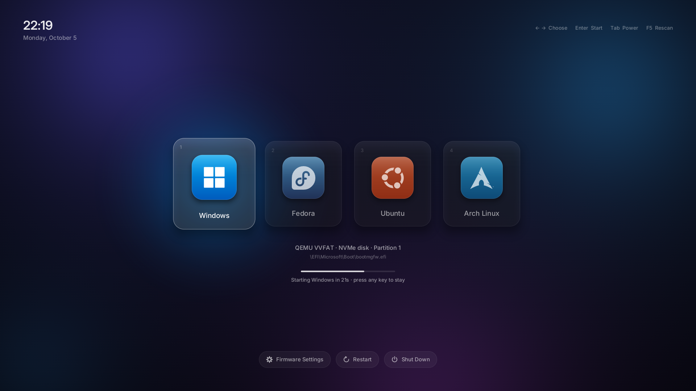
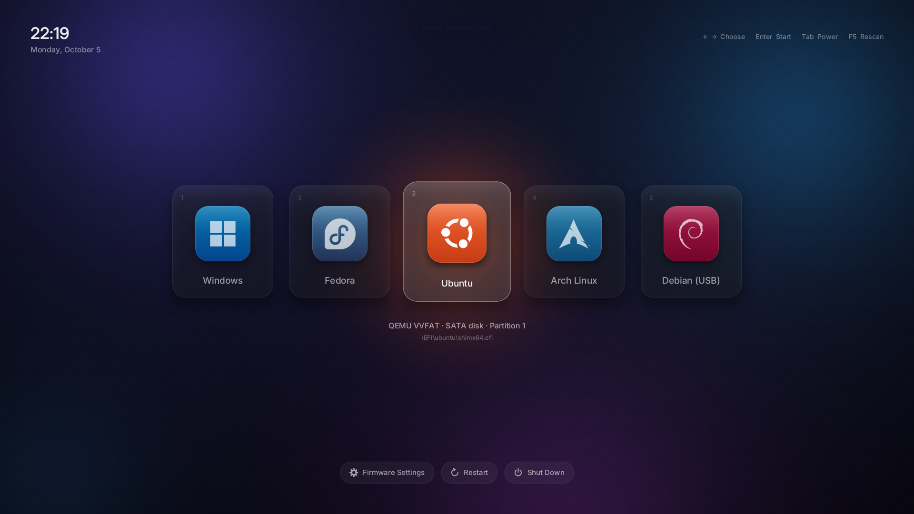
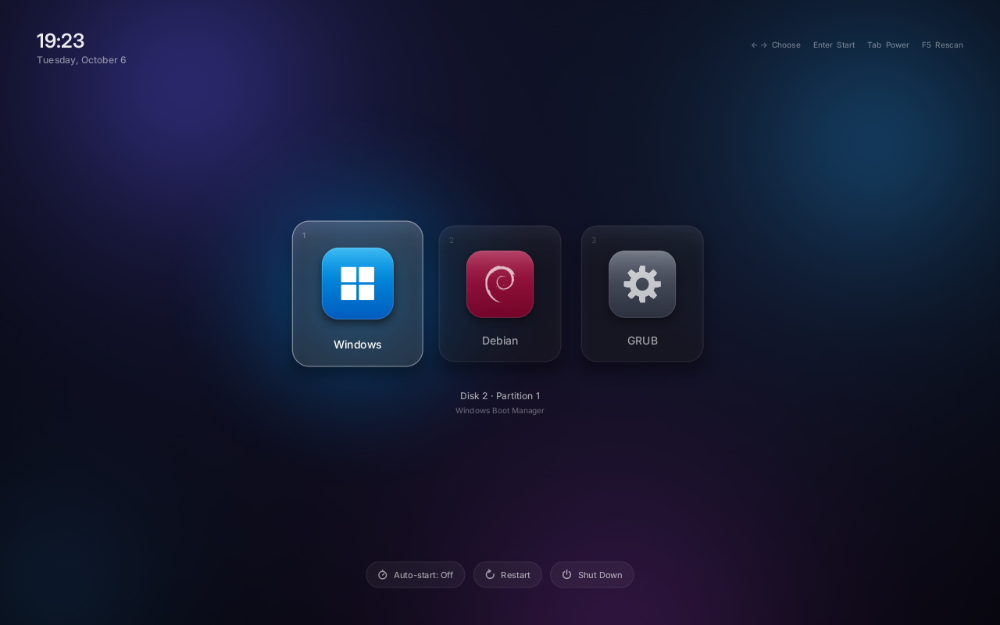
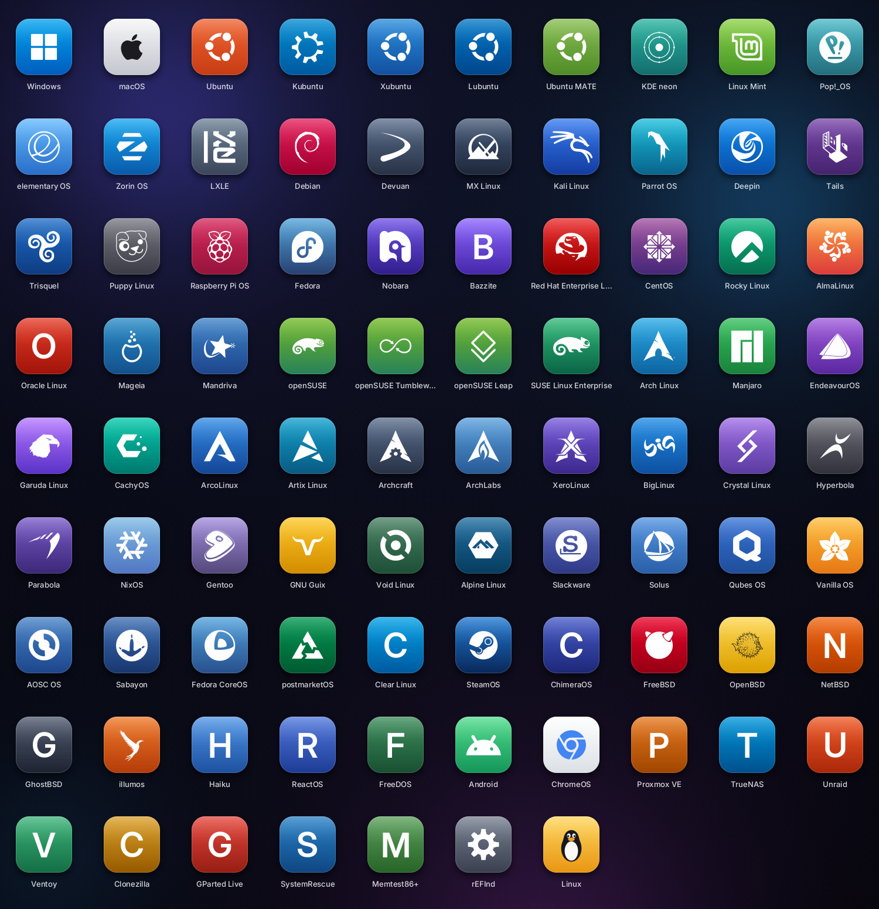
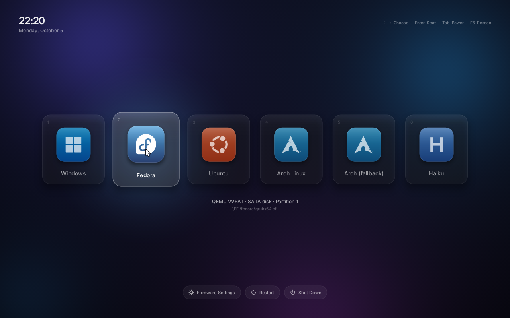
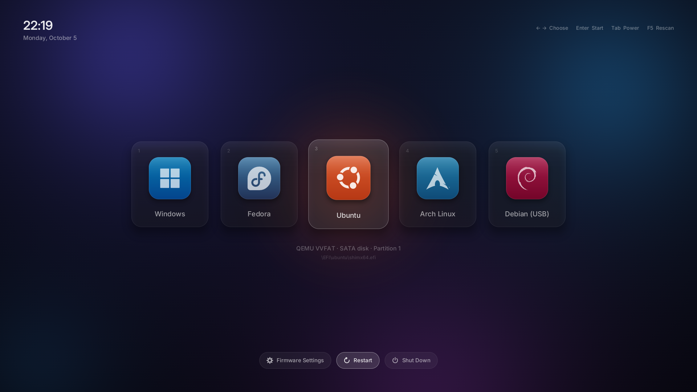
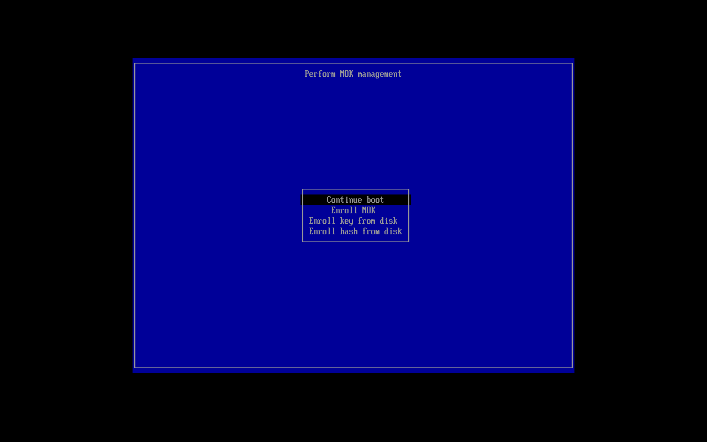
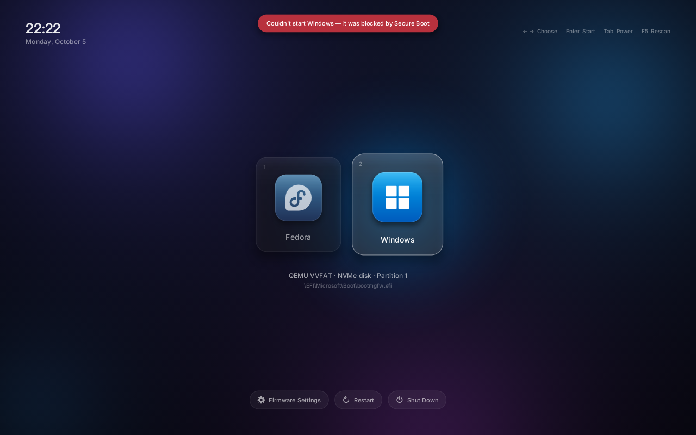

# Lumen



A graphical OS picker for PCs, new and old: UEFI PCs, and PCs that start in
legacy BIOS mode. It runs before any operating system, finds every OS on
every drive and USB stick, and starts the one you pick. Each OS gets a card
with its real logo in its brand colours. Animations are smooth, and you can
use the keyboard or a mouse/touchpad.

Picking Windows starts Windows Boot Manager. Picking Linux starts the Linux
kernel **directly**: Lumen reads the distro's own boot configuration from its
file system, so GRUB isn't involved (it stays installed, as a fallback).
Lumen works with Secure Boot on, survives Windows updates, GRUB updates and
firmware updates, and can't leave a PC unbootable.

## Finding every OS

Lumen runs in the firmware, so it doesn't depend on `os-prober` running
inside Linux the way GRUB does. It uses several independent sources:

1. **It connects every disk controller first.** Fast Boot firmware often only
   initialises the boot drive, so OSes on second SSDs, NVMe or USB disks would
   otherwise stay invisible.
2. **It scans every EFI partition** for known loaders:
   - Windows Boot Manager
   - macOS
   - each vendor folder under `\EFI\*` (shim, GRUB, systemd-boot, rEFInd,
     FreeBSD `loader.efi`, Clear Linux, Qubes `xen.efi`, elilo)
   - unified kernel images in `\EFI\Linux`
   - the UEFI Shell
3. **It reads the firmware's boot menu (`Boot####`).** Every OS installer
   registers itself there, so a loader at an unusual path still shows up.
   Entries for partitions that no longer exist are hidden.
4. **It detects live and installer USB sticks**, including ones plugged in
   while the menu is open. It works out what's on a stick from the strongest
   evidence available:
   1. Windows setup files, shown as "Windows Setup"
   2. `.disk/info`
   3. systemd-boot and GRUB menu titles
   4. the volume label
   5. the distro's signing certificate embedded in its shim

   So an Ubuntu, Fedora, Debian, Arch, openSUSE or Mint stick shows up by
   name, even with a blank label. A stick is always **one** card, even when
   it also carries its base distro's folder (Bazzite's has `\EFI\fedora`).



*A Debian live USB plugged in while the menu was open. Its label was blank,
so Lumen recognised it from the Debian certificate inside its shim.*

Partitions are matched by signature *and* file, so cloned disks and sticks
flashed from the same ISO are handled correctly.

## Starting Linux without GRUB

Lumen reads Linux file systems itself (ext2/3/4, XFS, Btrfs with zlib, zstd
and LZO compression and subvolumes, and FAT), finds each install's boot
configuration, and starts its kernel:

- **Where the kernel and its options come from:** Boot Loader Specification
  entries (`loader/entries/*.conf`: Fedora, RHEL and its rebuilds,
  Bazzite/Silverblue, systemd-boot setups) or the first menu entry of
  `grub.cfg` (Debian, Ubuntu, Mint, Arch, openSUSE...), with GRUB's
  variables, `search` commands and Btrfs subvolume paths resolved. The newest
  kernel is used, with exactly the command line the distro wrote.
- **Names come from the installed system** (`/etc/os-release`, found from
  `root=` on the kernel command line), so Mint is "Linux Mint" even though it
  boots from Ubuntu's folder, and Bazzite isn't mistaken for Fedora.
- **On UEFI PCs** the kernel's EFI stub is started with the command line, and
  the initrd is handed over through the standard `LINUX_EFI_INITRD_MEDIA`
  protocol (Linux 5.8 and later).
- **Under Secure Boot** the kernel must pass shim's own check, exactly as it
  must when GRUB loads it. Each distro signs its kernels with its own key,
  which its own shim carries. The installers read those keys from the
  distros' shims on the EFI partition (Canonical's for Ubuntu and its
  flavours, Fedora's, openSUSE's...) and include them in the same one-time
  approval as Lumen's key, so Lumen can start every installed distro
  directly. A distro installed later goes through its own GRUB until the
  installer is run again (it then asks to approve just the new key).
  Nothing is ever started that shim rejects. To approve only Lumen's own
  key, use `--no-distro-keys` (Linux) or `-NoDistroKeys` (Windows script).
- **If anything fails,** Lumen falls back to the distro's own boot loader,
  which is still installed. The distro's loader card is merged into its Linux
  card, so each system appears once.

Tested by starting real installs of Debian 13, Ubuntu 24.04, Fedora 44
(Btrfs, BLS), openSUSE Tumbleweed (Btrfs snapshots), Arch Linux and
AlmaLinux 9 (XFS) to their login prompts. `linux-direct off` in `lumen.conf`
goes back to always starting the distro's boot loader.

## Older PCs (legacy BIOS)



PCs without UEFI, and UEFI PCs set to legacy/CSM mode, get the same menu.
The installers notice which mode the PC started in.

- **Where it lives:** Lumen's boot code goes in the boot disk's MBR (its
  partition table and disk signature are kept), and the rest (about 500 KB)
  in the empty space before the first partition, which every disk
  partitioned since Windows Vista has (1 MB). The installer refuses if that
  space is in use by anything else, and stays clear of GRUB's core image.
- **What it starts:** Windows (through its own boot code, exactly as before
  Lumen), Linux (the kernel directly, through the Linux x86 boot protocol),
  live USB sticks, other bootable disks, and the boot loader that was there
  before (shown as e.g. "GRUB").
- **It can't strand you:** hold **Shift** while the PC starts to skip Lumen
  and start the previous boot loader. Lumen also falls back to it by itself
  if its own data is damaged or it hits an error.
- **BitLocker** is paused for one restart whenever the boot code changes, so
  Windows never asks for the recovery key.
- **Update-proof:** if a GRUB update (`grub-install`) or a Windows repair tool
  writes its own boot code into the MBR, the repair task (Windows) or
  `lumen-heal` (Linux) puts Lumen back at the next shutdown, keeping the new
  boot code as the previous boot loader.
- **Uninstalling** puts the previous boot code back.

Requirements: a 64-bit PC with VESA graphics (any PC from the last 20 years),
and 64-bit Windows or Linux to run the installer from.

## Icons

There are about 85 OS tiles. They use real logos from
[Font Logos](https://github.com/lukas-w/font-logos) (public domain) and
[Font Awesome Free](https://fontawesome.com) brands (CC BY 4.0). They cover:

- Windows and macOS
- the Ubuntu family, Mint, Pop!_OS, elementary and Zorin
- Debian, Kali, MX and Tails
- Fedora, Nobara, RHEL, CentOS, Rocky and Alma
- openSUSE and SUSE
- Arch, Manjaro, EndeavourOS, CachyOS and Garuda
- NixOS, Gentoo, Void, Alpine, Slackware, Solus and Qubes
- SteamOS and Android
- ChromeOS, FreeBSD and OpenBSD
- and many more

Projects without a logo glyph, such as Haiku and Proxmox, get a brand-coloured
letter tile.



To preview every tile: `cargo run --release --manifest-path
tools/gallery/Cargo.toml -- gallery.ppm`.

## Keys and mouse

| Input | Action |
| --- | --- |
| ← → / mouse hover / scroll wheel | choose |
| Enter, Space, click | start |
| 1–9 | start that entry immediately |
| Tab, ↓ / ↑ | OS row ↔ Auto-start / Firmware Settings / Restart / Shut Down |
| Esc / any key / moving the mouse | stop the countdown |
| F5 | rescan (rarely needed: new USB sticks are detected automatically) |

| Mouse | Power row |
| --- | --- |
|  |  |

Mice and touchpads (relative pointers) and touchscreens/tablets (absolute
pointers) all work, as long as the firmware has a driver for them, which
nearly all PC firmware does. Lumen highlights whatever you booted last time and **waits until you
choose**. To start it automatically, press the **Auto-start** button in the
bottom row: it cycles Off → 5 s → 10 s → 30 s, and the choice is saved in the
PC's firmware (it survives reinstalls and overrides `timeout` in
`lumen.conf`).

## Secure Boot

Lumen boots the way Linux distributions do under Secure Boot:

```
firmware ──▶ shim (signed by Microsoft) ──▶ Lumen (signed with Lumen's key)
                                               ├──▶ Windows Boot Manager
                                               └──▶ distro shim ──▶ GRUB …
```

The installer adds Lumen's public key once as a Machine Owner Key (MOK). On
the next boot a blue *Shim UEFI key management* screen appears:

1. Press a key.
2. Choose **Enroll MOK**, then **Continue**, then **Yes**.
3. Type the one-time password you chose during install.
4. Reboot.

After that, Lumen starts automatically with Secure Boot fully on. The
installers ask for this approval **even when Secure Boot is off**, so turning
it on later doesn't stop Lumen from starting. If Secure Boot is ever on
without the approval (a BIOS reset can wipe it), the repair tasks step Lumen
aside so the PC starts Windows/Linux directly instead of stopping at shim's
error screen; re-running the installer brings Lumen back.

| One-time key approval (shim's MokManager) | A loader Secure Boot refuses |
| --- | --- |
|  |  |

- **Linux** uses `mokutil`, with a built-in fallback if it isn't installed.
- **Windows** has no `mokutil`, so the installer writes the same enrollment
  request through the Windows firmware API.

Loaders that Secure Boot rejects are reported in the UI, and Lumen falls back
to the firmware's own boot entry for that OS.

**BitLocker.** Starting Windows through any boot manager changes the TPM
measurements, which can trigger a recovery-key prompt. Both installers detect
BitLocker and add `bootnext Windows` to the config. Windows is then started
through the firmware's own entry (one quick reboot), measured exactly like a
normal boot.

## Update-proof

Windows feature updates, distro GRUB updates (`grub-install`) and BIOS
updates can reorder or wipe firmware boot entries. Lumen repairs this in
three places:

- **Lumen itself.** Each time it starts from its own entry, it moves itself
  back to first if something jumped ahead.
- **Windows.** A SYSTEM scheduled task, *Lumen boot order*, runs at startup,
  when shutdown begins, and after Windows Update installs anything. It
  recreates Lumen's entry if it was deleted and puts it back first. It edits
  the firmware variables directly, so it doesn't depend on `bcdedit`'s
  localised output.
- **Linux.** `lumen-heal.service` does the same at every boot and shutdown.

- **Lumen itself, while you use other systems.** Installing another Linux
  or a GRUB update runs `grub-install`, which puts that distro's entry first.
  Windows updates can do the same. Whenever Lumen starts an OS, it also sets
  the firmware's one-shot "next boot" to Lumen. Those tools change the boot
  order but not that setting, so the next start lands in Lumen anyway, and
  Lumen takes first place back. Turn this off with `stay-default off` in
  `lumen.conf`.

None of these ever remove other entries.

> If something did take over before this was in place (Lumen 0.3.0 and
> earlier), open your PC's boot menu once (often F11, F12 or F8 at power-on)
> and choose **Lumen**: it moves itself back to first.

## It can't strand you

- **Lumen is its own entry in the boot order**, alongside Windows Boot
  Manager and GRUB, not a replacement for them. If it's missing, refused or
  broken, the firmware boots the next entry, as it does today.
- **If Lumen crashes, it exits to the firmware**, which boots the next entry.
  It never hangs or powers off.
- **The firmware watchdog is turned off while the menu is open.**

## Install

Download and run the installer for the OS you're using right now. You only
need to do this once, from any one of your systems.

| | |
| --- | --- |
| **Windows** | Double-click **`Lumen-Installer-Windows.exe`** and approve the administrator prompt. Works on x64 and ARM64 PCs. |
| **Linux** | Double-click **`Lumen-Installer-Linux.run`**, or run `sh Lumen-Installer-Linux.run` in a terminal. Works on x86_64 and aarch64. |

The installer shows what will happen, does it, and tells you the one thing
you might need to do yourself. If Secure Boot is on, that's typing a 4-digit
code on a blue approval screen at the next restart. The code is digits only,
because that screen uses a US keyboard layout.

**Why it can't break booting:**

- **Lumen is added next to your existing boot loaders and doesn't replace
  them.** Windows Boot Manager and GRUB are never modified.
- **Lumen is first tried as the *next boot only*.** Your current default stays
  the default until Lumen has actually started on that PC and drawn its menu.
  Only then does it make itself the default. If the first start fails for
  any reason (a skipped Secure Boot approval, odd firmware, a graphics
  problem), the PC simply keeps starting the way it always has.
- **The installer checks everything first and undoes everything if any step
  fails.** That includes UEFI mode, administrator rights, the EFI partition,
  free space and the processor type. On Linux it also installs `efibootmgr`
  if needed and mounts the EFI partition if your distro doesn't.
- **Files are written under a temporary name, then verified.**
- **On BIOS PCs**, the only existing thing changed is the MBR's 440 bytes of
  boot code, which are kept and stay one card (or Shift) away. Lumen's data
  is written and read back before the MBR is touched.
- **Logs:** `%ProgramData%\Lumen\install.log` on Windows; terminal output
  on Linux.

**Uninstall:**

- **Windows:** Settings → Apps → *Lumen boot manager* → Uninstall.
- **Linux:** `sh Lumen-Installer-Linux.run --uninstall`.

Either way the PC starts exactly as it did before.

**Silent deployment:** `Lumen-Installer-Windows.exe /quiet` (and
`/quiet /uninstall`). On Linux, use `sudo ./install-linux.sh --yes` from a
bundle.

### Building the installers

```sh
brew install mingw-w64 osslsigncode     # macOS; apt install mingw-w64 osslsigncode on Linux
tools/make-installers.sh                # -> dist/Lumen-Installer-{Windows.exe,Linux.run}, SHA256SUMS
```

This builds both architectures, signs Lumen with `keys/lumen.key`, and embeds
Debian's Microsoft-signed shim, fetched with pinned hashes.

### Signing key

This works like rEFInd and other open-source boot projects. The code is
public, but releases are signed with a private key that's never in the repo.

- PCs that approved Lumen under Secure Boot trust exactly one key: the
  private half of [`release/lumen.cer`](release/README.md).
- A clone or fork can build Lumen, but can't sign as this project. Forks sign
  with their own key (`tools/genkey.sh --new-project`), and users of that fork
  approve that key instead.

| Task | Command |
| --- | --- |
| Create or replace the release key (RSA-4096, passphrase-protected) | `tools/genkey.sh --rotate` |
| Print a paper backup (QR codes + text, no passphrase on it) | `python3 tools/key-backup-sheet.py` |
| Restore from the paper backup or a key file | `tools/restore-key.sh FILE` |
| Build signed release installers (asks for the passphrase once) | `tools/make-installers.sh` |

`tools/dist.sh` refuses to sign with anything that doesn't match the
committed `release/lumen.cer`, and `genkey.sh` never replaces a key without
`--rotate`.

**Keep:**
1. the passphrase in your password manager;
2. the printed sheet somewhere safe;
3. a copy of the encrypted `keys/lumen.key` as an attachment in your password
   manager.

Test builds (CI) use `LUMEN_TEST_KEY=1`, which signs with a separate throwaway
key; never install those on a real PC.

> **Windows SmartScreen:** until the `.exe` is Authenticode-signed with a code
> signing certificate, Windows shows *"Windows protected your PC"*. Click
> *More info → Run anyway*.

## When something goes wrong

- **Lumen says so.** If an OS had to be started a different way than usual
  (for example Linux through its own GRUB because Secure Boot refused the
  kernel), Lumen shows why the next time it starts, with what to do.
- **`\EFI\lumen\lumen.log`** on the EFI system partition records what
  Lumen found at its last start (each partition, each boot configuration it
  read) and how starting each system went. It's plain text: on Linux it's
  usually `/boot/efi/EFI/lumen/lumen.log`; on Windows the Windows
  installer's diagnostics report includes it.

## Configuration

`\EFI\lumen\lumen.conf`:

```
timeout 10           # auto-start after N s (default: wait; 0 = immediately); the Auto-start button overrides it
default last         # or part of a title, e.g. "Windows"
hide Recovery        # hide matching entries
bootnext Windows     # start via firmware entry + reboot (BitLocker-safe)
resolution keep      # keep | max | 1920x1080
clock off
debug on             # on-screen frame timing, for performance reports
stay-default off     # don't make the next start return to Lumen (see Update-proof)
linux-direct off     # start Linux through its own boot loader instead of directly
entry Arch (fallback) | \EFI\Linux\arch-linux.efi | initrd=\initramfs-linux-fallback.img
```

## Testing in a VM

`tools/vm.py` simulates the following:

| Scenario | How it's tested |
| --- | --- |
| Multiple drives | a SATA Linux disk with Lumen, and an NVMe Windows disk |
| Firmware-only entries | an installer-registered entry at an odd path, plus a stale entry |
| Hot-plugged USB sticks | `--plug usb_debian`, `--plug usb_arch` |
| Scripted mouse | `--mouse-test X Y` |
| Boot-order self-heal | `--heal-test` |
| Secure Boot with Microsoft keys only | `--secureboot`, with the MOK enrolled (`--mok=enrolled`) or queued the way the Windows installer does it (`--mok=queued`) |

Each "OS" is a small test loader that prints how it was started.

```sh
brew install qemu osslsigncode && pip install virt-firmware
cargo efi-x64 --features debugcon && cargo build --release --examples && tools/dist.sh
python3 tools/vm.py                                    # interactive window
python3 tools/vm.py --headless --wait 30 --shot menu   # -> target/vm/menu.png
python3 tools/test/check_windows_installer.py pwsh     # Windows installer byte-level checks
tools/linux-vm-test.py debian-13-genericcloud-arm64.qcow2   # real Debian: install, first boot, heal, uninstall
```

Discovery decisions are logged to `target/vm/debug.log` in `debugcon`
builds.

More tests:

| Test | What it checks |
| --- | --- |
| `cargo test -p lumen-core --test fs` | every file system reader, byte for byte, against images made by the real `mkfs` tools (`tools/test/make-fs-fixtures.sh`, needs Docker) |
| `tools/test/linux-direct.py DISK.qcow2 [--secureboot]` | Lumen starts a real distro's kernel itself on UEFI (and, under Secure Boot, only kernels shim accepts) |
| `tools/test/bios-smoke.sh` | Lumen for BIOS under SeaBIOS: menu, Windows chains, damaged-data fallback, power off |
| `tools/test/linux-bios-test.py DISK.qcow2` | real Debian in BIOS mode: install, `grub-install` displaces Lumen, heal, Lumen starts Debian directly, uninstall |
| `cargo test -p lumen-biosinstall` | the BIOS installer on MBR/GPT/GRUB disks: free-space checks, update, heal, uninstall |

## Known limits

- On a UEFI PC, operating systems installed in legacy BIOS mode can't be
  started (the firmware doesn't allow it) and are hidden; the same goes the
  other way round.
- Linux on LVM or LUKS: the kernel is found when `/boot` is a plain
  partition (the usual layout), but the name then comes from the boot
  entry's title rather than os-release.
- Under Secure Boot, Lumen can only directly start loaders trusted by the
  firmware's `db`, such as Windows and distro shims. Anything signed only by
  a MOK falls back to its firmware entry.
- The BIOS edition needs about 500 KB free before the first partition;
  disks partitioned by Windows XP or older (63 sectors) don't have it.
- Rendering is done in software on the CPU. It's only been tested in QEMU
  (emulated x86 on Apple Silicon), so smoothness on real hardware, especially
  4K panels, still needs checking.

## Layout

| Path | Contents |
| --- | --- |
| `crates/core` | shared by both editions: UI, renderer, icons, OS table, config, file system readers (`fs/`), Linux boot discovery (`linux.rs`) |
| `crates/uefi` | the UEFI app: discovery, chainloading, direct Linux start, boot-order self-heal |
| `crates/bios` | the BIOS edition: MBR and real-mode stages, VESA graphics, BIOS disks, Linux boot protocol |
| `crates/biosinstall` | puts the BIOS edition into a disk's MBR (used by both installers) |
| `install/` | Linux/Windows installer logic, heal service, MOK request |
| `installer/windows/` | one-click `.exe` launcher (embeds the bundles) |
| `.github/workflows/ci.yml` | builds everything; real install/heal/uninstall on a Windows runner |
| `tools/` | dist/sign/fetch scripts, VM harness, icon gallery, tests |

## License

Lumen is MIT-licensed (see [`LICENSE`](LICENSE)). Bundled fonts, logos and the
Microsoft-signed shim keep their own licenses; see
[`THIRD-PARTY-NOTICES.md`](THIRD-PARTY-NOTICES.md).
